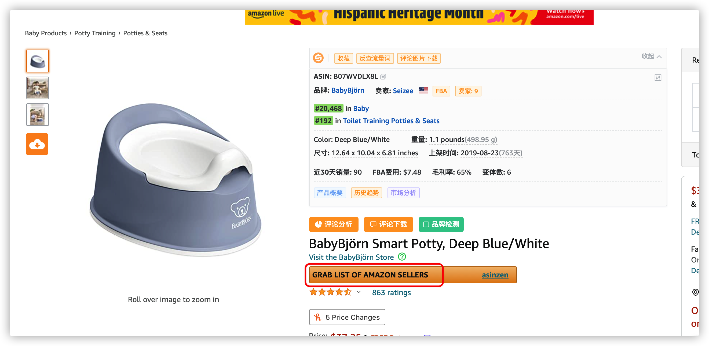
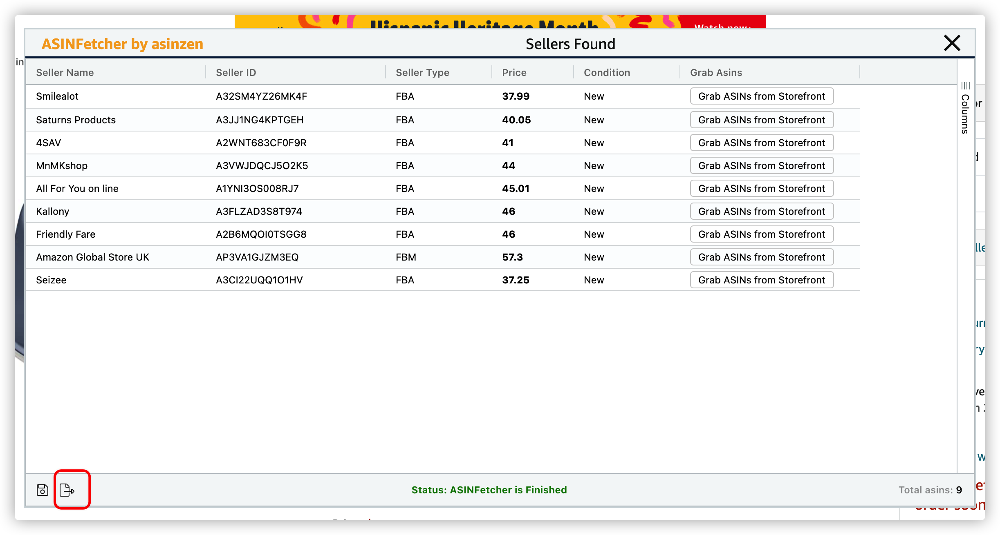

# python-tools

## python3日常小工具仓库
本项目记录平时学习到的小脚本，无论是从安全方面，还是从工具的使用方面上...

Environment(环境)
---

- python3+
- selenium（自行对应Google Chrome版本）
- Google Chrome

脚本讲解
---
1、下载谷歌插件，ASINFetcher

[点击这里](https://chrome.google.com/webstore/detail/asinfetcher-amazon-asin-g/eiiaminhipheiklkloadaapojkpgmdfm?hl=en)

2、点击下图

3、重命名csv，为 1.csv

4、执行脚本即可

